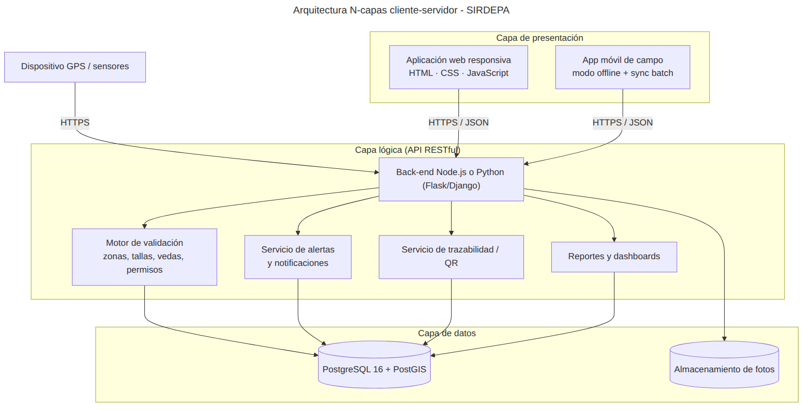

# ODS 14 - Vida Submarina 🌊

**SIRDEPA - Sistema de Registro de Desembarque Pesquero Artesanal**

Sistema de monitoreo pesquero sostenible para el Perú que combina GPS, bitácora digital, sensores marinos y trazabilidad por código QR, para combatir la pesca ilegal y apoyar a IMARPE y PRODUCE en la gestión de los recursos hidrobiológicos. Alineado con el **Objetivo de Desarrollo Sostenible 14: Vida Submarina**.

> Proyecto del curso **Análisis y Diseño de Software** - NRC 62152 - Universidad Continental, 2025

## Integrantes

- Oroya Molina, Luis Fernando
- Cárdenas Rosales, Abigail
- Yupanqui Castro, Romina
- Olarte Tuya, Shadi Allegra Rashel
- Gonzales Zárate, Jhosep Rafael

## Problema

La pesca en el Perú sufre sobreexplotación de especies, pesca no regulada e ilegal y falta de monitoreo inmediato de capturas y áreas de faena, lo que amenaza la biodiversidad marina y la economía de las comunidades costeras.

## Solución

| Módulo | Qué hace |
|---|---|
| Gestión de flota | Registro de embarcaciones y pescadores; posición GPS cada 15 minutos |
| Bitácora digital | Registro de capturas por especie, talla y peso, con fotos como evidencia |
| Validación automática | Detecta ingreso a zonas restringidas, tallas menores, vedas y permisos vencidos |
| Alertas | Notifica a IMARPE, PRODUCE y al usuario ante cualquier irregularidad |
| Trazabilidad | Código QR único por lote que certifica el origen legal del producto |
| Inteligencia pesquera | Dashboards, reportes e indicadores de sostenibilidad |

**Beneficiarios:** IMARPE, PRODUCE, armadores, pescadores artesanales, comunidades costeras, consumidores y organizaciones ambientales.

## Arquitectura

Arquitectura **N-capas cliente-servidor** con API RESTful:

- **Presentación:** aplicación web responsiva (HTML, CSS, JavaScript) y app móvil de campo con modo offline
- **Lógica:** back-end en Node.js o Python (Flask/Django)
- **Datos:** PostgreSQL 16 + PostGIS



## Estructura del repositorio

```
.
├── README.md
├── docs/
│   ├── requerimientos.md        # RF, RNF, RD, reglas de negocio y trazabilidad
│   └── prototipos/              # Mockups de la app web y móvil
├── diagramas/
│   ├── fuentes/                 # Código Mermaid (.mmd) editable
│   └── png/                     # Diagramas exportados
├── base-de-datos/
│   ├── sirdepa_schema.sql       # Script PostgreSQL + PostGIS (tablas, triggers, vistas, datos semilla)
│   ├── sirdepa.dbml             # Modelo para dbdiagram.io
│   └── diccionario_datos.json   # Diccionario de datos
├── backlog/
│   ├── backlog.md               # Épicas, historias de usuario y sprints
│   └── jira_import.csv          # Backlog listo para importar a Jira
└── .gitignore
```

## Diagramas

| Diagrama | Fuente | Imagen |
|---|---|---|
| Contexto | [01_diagrama_contexto.mmd](diagramas/fuentes/01_diagrama_contexto.mmd) | [PNG](diagramas/png/01_diagrama_contexto.png) |
| Casos de uso | [02_casos_de_uso.mmd](diagramas/fuentes/02_casos_de_uso.mmd) | [PNG](diagramas/png/02_casos_de_uso.png) |
| Actividad | [03_diagrama_actividad.mmd](diagramas/fuentes/03_diagrama_actividad.mmd) | [PNG](diagramas/png/03_diagrama_actividad.png) |
| Entidad-Relación | [04_modelo_er.mmd](diagramas/fuentes/04_modelo_er.mmd) | [PNG](diagramas/png/04_modelo_er.png) |
| Clases | [05_diagrama_clases.mmd](diagramas/fuentes/05_diagrama_clases.mmd) | [PNG](diagramas/png/05_diagrama_clases.png) |
| Secuencia | [06_diagrama_secuencia.mmd](diagramas/fuentes/06_diagrama_secuencia.mmd) | [PNG](diagramas/png/06_diagrama_secuencia.png) |
| Arquitectura | [07_arquitectura.mmd](diagramas/fuentes/07_arquitectura.mmd) | [PNG](diagramas/png/07_arquitectura.png) |

Para editar o volver a exportar un diagrama, pegar su `.mmd` en [mermaid.live](https://mermaid.live).

## Base de datos

```bash
createdb sirdepa
psql -d sirdepa -f base-de-datos/sirdepa_schema.sql
```

Requiere PostgreSQL 16 con la extensión PostGIS. El script crea el esquema `sirdepa` con 17 tablas, triggers de validación automática (zona restringida, talla mínima, veda, permiso vigente, auditoría) y vistas para reportes. Para ver el modelo, pegar `sirdepa.dbml` en [dbdiagram.io](https://dbdiagram.io).

## Metodología

**Scrum** con sprints de 2 semanas, gestionado en Jira.

| Sprint | Objetivo | Historias |
|---|---|---|
| Sprint 1 | Gestión de flota pesquera y actividades pesqueras | HU01 – HU06 |
| Sprint 2 | Gestión normativa, inteligencia pesquera y medioambiental | HU07 – HU15 |

Detalle en [backlog/backlog.md](backlog/backlog.md).

## Herramientas

Jira · GitHub · Mermaid · dbdiagram.io · Draw.io · Canva · PostgreSQL + PostGIS
